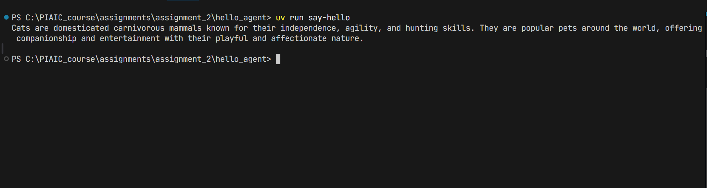

## I have made a custom script in pyproject.toml, it is : say-hello = "hello_agent.agent_hello:helloAgent"

## Use "uv run say-hello" command to run the code (but it will not work without API key).

## Following is output of code

